  <!-- Contador de visitas -->
  

    
  

  <h1>
    
  </h1>

   

  <h2 style="color: #ff0000;">📊 ESTATÍSTICAS</h2>
  

    
  

  

  <h2 style="color: #ff0000;">🧰 ARSENAL CIENTÍFICO</h2>
  

    
    
    
    
    
    
    
    
    
    
    
    
    
    
  

  

  <h2 style="color: #ff0000;">📡 CONEXÕES</h2>
  

    
    
    
  

  

    
  

